# Max Headbox Architecture Diagrams

Visual representation of the modular architecture with development lifecycle.

---

## 1. Complete System Architecture (Hardware to Application)

```mermaid
graph TB
    subgraph Hardware["🔧 HARDWARE LAYER"]
        MIC[🎤 USB Microphone<br/>/dev/snd/pcmC0D0c]
        TOUCH[👆 Touchscreen<br/>ADS7846<br/>/dev/input/event1]
        DISPLAY[🖥️ HDMI Display]
        CPU[💻 Raspberry Pi CPU<br/>ARM Cortex]
    end

    subgraph Kernel["🐧 LINUX KERNEL"]
        ALSA[ALSA Driver<br/>Audio System]
        EVDEV[evdev Driver<br/>Input Events]
        FB[Framebuffer<br/>Graphics]
    end

    subgraph System["⚙️ SYSTEM SERVICES"]
        XORG[X Server :0<br/>Display Manager]
        OPENBOX[Openbox<br/>Window Manager]
    end

    subgraph Browser["🌐 CHROMIUM BROWSER"]
        CHROMIUM[Chromium Kiosk Mode<br/>Port 4173]
        RENDERER[HTML/CSS/JS Renderer]
    end

    subgraph Frontend["⚛️ REACT FRONTEND"]
        REACT[React App<br/>SimpleApp.jsx]
        WSCONN[WebSocket Client]
    end

    subgraph Backend["🔴 BACKEND MODULES"]
        SERVER_NEW[server_new.rb<br/>260 lines<br/>Route Definitions]

        subgraph AUDIO["Audio Module"]
            RECORDER[recorder.rb<br/>Recording Logic]
            TRANSCRIBER[transcriber.rb<br/>Whisper Client]
            WHISPER_SVC[whisper_service.py<br/>FastAPI :8000]
        end

        subgraph LLM["LLM Module"]
            GATEWAY[gateway.rb<br/>Ollama Wrapper]
        end

        subgraph TOOLS["Tools Module"]
            WEATHER[weather.rb<br/>Open-Meteo API]
            WIKI[wiki.rb<br/>Wikipedia API]
            SYSINFO[sysinfo.rb<br/>System Info]
            NOTES[notes.rb<br/>File Storage]
        end

        subgraph CORE["Core Module"]
            WS_MGR[websocket_manager.rb<br/>Broadcast Helper]
        end
    end

    subgraph External["🌍 EXTERNAL SERVICES"]
        OLLAMA[Ollama<br/>:11434<br/>gemma3:1b]
        APIS[External APIs<br/>Weather/Wiki]
    end

    %% Hardware to Kernel
    MIC -->|Audio Signal| ALSA
    TOUCH -->|Touch Events| EVDEV
    DISPLAY -->|Video Signal| FB

    %% Kernel to System
    ALSA -->|/dev/snd/*| XORG
    EVDEV -->|/dev/input/*| XORG
    FB -->|Graphics Buffer| XORG

    %% System to Browser
    XORG --> OPENBOX
    OPENBOX --> CHROMIUM
    CHROMIUM --> RENDERER
    RENDERER --> REACT

    %% Frontend to Backend
    REACT --> WSCONN
    WSCONN -->|WebSocket| SERVER_NEW
    REACT -->|HTTP| SERVER_NEW

    %% Backend Internal
    SERVER_NEW --> AUDIO
    SERVER_NEW --> LLM
    SERVER_NEW --> TOOLS
    SERVER_NEW --> CORE

    %% Backend to Hardware
    RECORDER -->|sox command| ALSA
    WHISPER_SVC -->|Read WAV| ALSA

    %% Backend to External
    GATEWAY --> OLLAMA
    TOOLS --> APIS
    TRANSCRIBER --> WHISPER_SVC

    %% WebSocket flow
    WS_MGR -->|Events| WSCONN

    %% Styling
    style Hardware fill:#1a1a1a,stroke:#fff,color:#fff
    style Kernel fill:#2d2d2d,stroke:#fff,color:#fff
    style System fill:#0066cc,stroke:#fff,color:#fff
    style Browser fill:#4285f4,stroke:#fff,color:#fff
    style Frontend fill:#61dafb,stroke:#000,color:#000
    style Backend fill:#cc0000,stroke:#fff,color:#fff
    style External fill:#ff9800,stroke:#fff,color:#fff

    style AUDIO fill:#4caf50,stroke:#fff,color:#fff
    style LLM fill:#ff6b6b,stroke:#fff,color:#fff
    style TOOLS fill:#ff9800,stroke:#fff,color:#fff
    style CORE fill:#9c27b0,stroke:#fff,color:#fff
    style SERVER_NEW fill:#2196f3,stroke:#fff,color:#fff

    style MIC fill:#4caf50,stroke:#fff,color:#fff
    style TOUCH fill:#ffeb3b,stroke:#000,color:#000
```



---

## 2. Logging Infrastructure (Where Logs Come From)

```mermaid
graph TB
    subgraph Application["APPLICATION LAYER"]
        subgraph Backend["Backend Modules (Ruby)"]
            RECORDER[recorder.rb<br/>@logger.info]
            TRANSCRIBER[transcriber.rb<br/>@logger.info]
            GATEWAY[gateway.rb<br/>@logger.info]
            WS_MGR[websocket_manager.rb<br/>@logger.info]
            SERVER[server_new.rb<br/>@logger = Logger.new]
        end

        subgraph Python["Python Services"]
            WHISPER[whisper_service.py<br/>logging.info]
        end

        subgraph Frontend["Frontend (JavaScript)"]
            REACT[SimpleApp.jsx<br/>console.log]
        end
    end

    subgraph Outputs["LOG OUTPUTS"]
        BACKEND_LOG[/tmp/backend.log<br/>Ruby backend logs]
        WHISPER_LOG[/tmp/whisper.log<br/>Whisper service logs]
        VITE_LOG[/tmp/vite.log<br/>Vite server logs]
        BROWSER_CONSOLE[Browser Console<br/>React logs]
    end

    subgraph Tools["DEVELOPER TOOLS"]
        VIEW_LOGS[./scripts/view_logs.sh<br/>Color-coded viewer]
        HEALTH[./scripts/health_check.sh<br/>Recent logs]
        GREP[grep/tail<br/>Search & filter]
    end

    subgraph Monitor["MONITORING (Your Mac)"]
        TERMINAL[Terminal<br/>SSH + tail -f]
    end

    %% Backend logging flow
    SERVER -->|Creates logger| RECORDER
    SERVER -->|Injects logger| TRANSCRIBER
    SERVER -->|Injects logger| GATEWAY
    SERVER -->|Injects logger| WS_MGR

    RECORDER -->|Writes to stdout| BACKEND_LOG
    TRANSCRIBER -->|Writes to stdout| BACKEND_LOG
    GATEWAY -->|Writes to stdout| BACKEND_LOG
    WS_MGR -->|Writes to stdout| BACKEND_LOG
    SERVER -->|Writes to stdout| BACKEND_LOG

    %% Python logging
    WHISPER -->|uvicorn stdout| WHISPER_LOG

    %% Frontend logging
    REACT -->|console.log| BROWSER_CONSOLE

    %% Tools consume logs
    BACKEND_LOG --> VIEW_LOGS
    WHISPER_LOG --> VIEW_LOGS
    VITE_LOG --> VIEW_LOGS

    BACKEND_LOG --> HEALTH
    WHISPER_LOG --> HEALTH

    BACKEND_LOG --> GREP

    %% Developer views
    VIEW_LOGS --> TERMINAL
    HEALTH --> TERMINAL
    GREP --> TERMINAL

    %% Styling
    style Backend fill:#cc0000,stroke:#fff,color:#fff
    style Python fill:#3776ab,stroke:#fff,color:#fff
    style Frontend fill:#61dafb,stroke:#000,color:#000
    style Outputs fill:#ff9800,stroke:#fff,color:#fff
    style Tools fill:#4caf50,stroke:#fff,color:#fff
    style Monitor fill:#9c27b0,stroke:#fff,color:#fff

    style BACKEND_LOG fill:#f44336,stroke:#fff,color:#fff
    style WHISPER_LOG fill:#4caf50,stroke:#fff,color:#fff
    style BROWSER_CONSOLE fill:#2196f3,stroke:#fff,color:#fff
```

**Key Logging Points:**

1. **server_new.rb** (server.rb:50) - Creates logger instance
   ```ruby
   @logger = Logger.new($stdout)
   ```

2. **Every module** receives logger via constructor:
   ```ruby
   recorder = Audio::Recorder.new(recordings_dir, logger)
   transcriber = Audio::Transcriber.new(whisper_url, logger)
   llm = LLM::Gateway.new(ollama_url, logger)
   ws_manager = Core::WebSocketManager.new(sockets, logger)
   ```

3. **Modules log at every step**:
   ```ruby
   @logger.info "[Recording] 🎤 Starting new recording..."
   @logger.info "[Transcription] ✅ Completed in 2.04s → \"#{text}\""
   @logger.info "[LLM] 💬 Calling Ollama..."
   @logger.info "[WebSocket] 📤 Sent event to 1 client(s)"
   ```

4. **Output redirection** (when services start):
   ```bash
   ruby server_new.rb > /tmp/backend.log 2>&1
   uvicorn whisper_service:app > /tmp/whisper.log 2>&1
   npm run preview > /tmp/vite.log 2>&1
   ```

---

## 3. Module Dependencies


---

## 3. Request Flow (Voice → Response)


---

## 4. Development Lifecycle


---

## 5. Logging Flow

```mermaid
graph TB
    subgraph Components["Application Components"]
        RECORDER_LOG[Audio::Recorder<br/>+ logger]
        TRANSCRIBER_LOG[Audio::Transcriber<br/>+ logger]
        LLM_LOG[LLM::Gateway<br/>+ logger]
        WS_LOG[WebSocketManager<br/>+ logger]
    end

    subgraph Logs["Log Files on Pi"]
        BACKEND_LOG[/tmp/backend.log]
        WHISPER_LOG[/tmp/whisper.log]
        VITE_LOG[/tmp/vite.log]
    end

    subgraph Tools["Developer Tools"]
        VIEW[view_logs.sh<br/>Real-time viewing]
        HEALTH_CHK[health_check.sh<br/>Recent logs]
        GREP[grep/tail<br/>Search logs]
    end

    RECORDER_LOG --> BACKEND_LOG
    TRANSCRIBER_LOG --> BACKEND_LOG
    LLM_LOG --> BACKEND_LOG
    WS_LOG --> BACKEND_LOG

    BACKEND_LOG --> VIEW
    WHISPER_LOG --> VIEW
    VITE_LOG --> VIEW

    BACKEND_LOG --> HEALTH_CHK
    WHISPER_LOG --> HEALTH_CHK

    BACKEND_LOG --> GREP

    style RECORDER_LOG fill:#4caf50,stroke:#fff,color:#fff
    style BACKEND_LOG fill:#ff9800,stroke:#fff,color:#fff
    style VIEW fill:#2196f3,stroke:#fff,color:#fff
```

---

## 6. Log Format Structure

```mermaid
graph LR
    subgraph "Log Entry Components"
        COMPONENT[Component<br/>'[Recording]']
        EMOJI[Emoji<br/>'🎤']
        ACTION[Action<br/>'Starting...']
        DETAILS[Details<br/>'PID: 12345']
    end

    COMPONENT --> EMOJI
    EMOJI --> ACTION
    ACTION --> DETAILS

    style COMPONENT fill:#2196f3,stroke:#fff,color:#fff
    style EMOJI fill:#4caf50,stroke:#fff,color:#fff
    style ACTION fill:#ff9800,stroke:#fff,color:#fff
    style DETAILS fill:#9c27b0,stroke:#fff,color:#fff
```

**Example Log Output**:
```
[Recording] 🎤 Starting new recording... (PID: 12345)
[Recording] ⏹️  Finished after 10.09s, file size: 293.5KB
[Transcription] 📝 Calling Whisper service...
[Transcription] ✅ Completed in 2.04s → "Hello there."
[WebSocket] 📤 Sent recording_finished event to 1 client(s)
[LLM] 💬 Calling Ollama (model: gemma3:1b, stream: false)
[LLM] ✅ Response received in 3.21s (156 chars)
```

---

## 7. Debugging Workflow


---

## 8. Service Health Check Flow

```mermaid
graph TB
    RUN[./scripts/health_check.sh]

    subgraph Checks["Health Checks"]
        PING[Ping Pi<br/>192.168.1.47]
        BACKEND_CHK[curl :4567/<br/>Check Backend]
        WHISPER_CHK[curl :8000/<br/>Check Whisper]
        OLLAMA_CHK[curl :11434/api/tags<br/>Check Ollama]
        FRONTEND_CHK[curl :4173/<br/>Check Frontend]
    end

    subgraph Status["System Status"]
        CPU[vcgencmd measure_temp<br/>CPU Temperature]
        UPTIME[uptime<br/>System Uptime]
        DISK[df -h<br/>Disk Space]
        MEM[free -h<br/>Memory Usage]
    end

    subgraph Recent["Recent Logs"]
        BACKEND_TAIL[tail -10 /tmp/backend.log]
        WHISPER_TAIL[tail -10 /tmp/whisper.log]
    end

    REPORT[Health Report<br/>✅ or ❌ for each service]

    RUN --> PING
    PING --> BACKEND_CHK
    PING --> WHISPER_CHK
    PING --> OLLAMA_CHK
    PING --> FRONTEND_CHK

    BACKEND_CHK --> CPU
    WHISPER_CHK --> UPTIME
    OLLAMA_CHK --> DISK
    FRONTEND_CHK --> MEM

    CPU --> BACKEND_TAIL
    UPTIME --> WHISPER_TAIL

    BACKEND_TAIL --> REPORT
    WHISPER_TAIL --> REPORT

    style RUN fill:#2196f3,stroke:#fff,color:#fff
    style REPORT fill:#4caf50,stroke:#fff,color:#fff
```



---

## 9. Deployment Flow (scripts/deploy.sh)

```mermaid
graph TB
    START[./scripts/deploy.sh]

    BUILD[npm run build<br/>Build Frontend]

    RSYNC[rsync to Pi<br/>Sync all code]

    REBUILD[Rebuild on Pi<br/>npm run build]

    STOP[Stop Services<br/>pkill processes]

    subgraph Start["Start Services"]
        START_WHISPER[Start Whisper<br/>uvicorn :8000]
        START_BACKEND[Start Backend<br/>ruby server_new.rb]
        START_FRONTEND[Start Frontend<br/>npm run preview]
    end

    subgraph Verify["Health Checks"]
        CHK_WHISPER[curl :8000/]
        CHK_BACKEND[curl :4567/]
        CHK_FRONTEND[curl :4173/]
    end

    LOGS[Show Last 10s of Logs]

    SUCCESS[✅ Deployment Complete!<br/>Show URLs]

    START --> BUILD
    BUILD --> RSYNC
    RSYNC --> REBUILD
    REBUILD --> STOP

    STOP --> START_WHISPER
    STOP --> START_BACKEND
    STOP --> START_FRONTEND

    START_WHISPER --> CHK_WHISPER
    START_BACKEND --> CHK_BACKEND
    START_FRONTEND --> CHK_FRONTEND

    CHK_WHISPER --> LOGS
    CHK_BACKEND --> LOGS
    CHK_FRONTEND --> LOGS

    LOGS --> SUCCESS

    style START fill:#2196f3,stroke:#fff,color:#fff
    style BUILD fill:#ff9800,stroke:#fff,color:#fff
    style SUCCESS fill:#4caf50,stroke:#fff,color:#fff
```



---

## 10. Rapid Iteration Cycle (Optimized Development Flow)


**Key Optimization**: Comprehensive logging enables rapid issue identification (2 min vs 20+ min guessing)

---

## 11. Module Interaction Example (Recording Flow)

```mermaid
graph TB
    subgraph "Route Handler (server_new.rb)"
        ROUTE[POST /start_recording]
    end

    subgraph "Audio Module"
        RECORDER_INIT[recorder = Audio::Recorder.new<br/>recordings_dir, logger]
        RECORDER_START[recorder.start<br/>Returns: pid, filepath]
        RECORDER_WAIT[recorder.wait_for_completion<br/>callback]
    end

    subgraph "Hardware"
        SOX[sox process<br/>Records audio]
        FILE[/dev/shm/recording.wav]
    end

    subgraph "Transcription Module"
        TRANS_INIT[transcriber = Audio::Transcriber.new<br/>whisper_url, logger]
        TRANS_CALL[transcriber.transcribe<br/>filepath]
    end

    subgraph "WebSocket Module"
        WS_INIT[ws_manager = Core::WebSocketManager.new<br/>sockets, logger]
        WS_BROADCAST[ws_manager.broadcast<br/>event, data]
    end

    ROUTE --> RECORDER_INIT
    RECORDER_INIT --> RECORDER_START
    RECORDER_START --> SOX
    SOX --> FILE
    RECORDER_START --> RECORDER_WAIT

    RECORDER_WAIT --> TRANS_INIT
    TRANS_INIT --> TRANS_CALL
    TRANS_CALL --> WS_INIT
    WS_INIT --> WS_BROADCAST

    style ROUTE fill:#2196f3,stroke:#fff,color:#fff
    style RECORDER_START fill:#4caf50,stroke:#fff,color:#fff
    style TRANS_CALL fill:#4caf50,stroke:#fff,color:#fff
    style WS_BROADCAST fill:#9c27b0,stroke:#fff,color:#fff
```

---

## Summary

These diagrams illustrate the complete Max Headbox system:

1. **Complete System Architecture**: Hardware → Linux Kernel → System Services → Application
   - Shows how the entire stack works from microphone to React UI
   - Includes all layers: Hardware, Kernel (ALSA/evdev), X Server, Browser, Backend modules

2. **Logging Infrastructure**: Where all the loggers are and how logs flow
   - Logger creation in server_new.rb
   - Logger injection into every module
   - Log outputs (/tmp/*.log files)
   - Developer tools (view_logs.sh, health_check.sh)

3. **Module Dependencies**: How backend modules interact with external services

4. **Request Flow**: Complete voice → response journey with modular components

4. **Development Lifecycle**: Code → Deploy → Test → Debug cycle

5. **Logging Flow**: How logs move from code to viewing tools

6. **Log Format**: Structured, emoji-prefixed, scannable format

7. **Debugging Workflow**: Fast issue identification process

8. **Health Check Flow**: Automated service verification

9. **Deployment Flow**: One-command automated deployment

10. **Rapid Iteration Cycle**: 13-minute development cycles with comprehensive logging

11. **Module Interaction**: Real-world example of modular design (recording flow)

**Key Principle**: The architecture optimizes for **rapid iteration through comprehensive logging and clean separation of concerns**.
