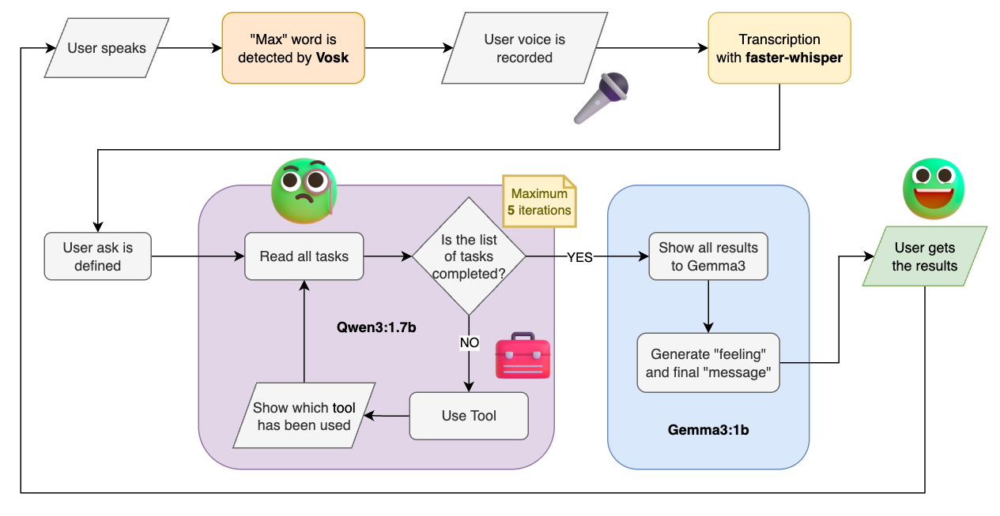

# Max Headbox

<p>
  
  
</p>
<p>
  
  
</p>

Max Headbox is an open-source voice-activated LLM Agent designed to run on a Raspberry Pi. It can be configured to execute a variety of tools and perform actions.

## Hardware Requirements

To get Max Headbox up and running, you'll need the following hardware:

* [Raspberry Pi 5](https://www.raspberrypi.com/products/raspberry-pi-5/)
* A _microphone_ is necessary for voice commands. (I've used [this one](https://www.amazon.com/dp/B071WH7FC6) from Amazon)
* [GeeekPi](https://www.amazon.com/dp/B0D7VDWBBC) Screen, Case, and Cooler: This all-in-one bundle from Amazon provides a screen, a protective case, and an active cooler to keep your Raspberry Pi running smoothly. (This bundle is optional but definitley use an active cooler!)

## Software Requirements

Ensure you have the following software installed before proceeding with the setup:

* Ruby 3.3.0
* Node 22
* Python 3
* Ollama

## Setup and Installation

Follow these steps to get Max Headbox set up and ready to run.

### 1. Clone the repository

```sh
git clone https://github.com/syxanash/maxheadbox.git
cd maxheadbox
```

### 2. Install Node dependencies

```sh
nvm use
npm install
```

### 3. Install backend dependencies

Navigate to the `backend/` directory and install the required Ruby and Python packages.

```sh
cd backend/
bundle install
pip3 install -r requirements.txt
```

### 4. Set up Ollama

After [installing Ollama](https://ollama.com/download/linux), pull the necessary language models:

```sh
ollama pull gemma3:1b
ollama pull qwen3:1.7b
```

## Configure

Before starting the app, you need to configure the following variables in your `.env` file:

```sh
VITE_BACKEND_URL=http://192.168.0.1:4567
VITE_WEBSOCKET_URL=ws://192.168.0.1:4567
VITE_OLLAMA_URL=http://192.168.0.1:11434
```

The first two variables use the same address since the WebSocket app also runs on Sinatra. If your Ollama instance is running on a different device, you'll need to specify its network address.

By default the recording directory is `/dev/shm/whisper_recordings` if you're developing and running the project on a different OS you can change this in your env file e.g.

```
RECORDINGS_DIR="~/Desktop/whisper_recordings"
```

## Usage

To start the Max Headbox agent, run the following command from the root of the project directory:

```sh
npm run start-prod
```

You should now be able to see the app running on localhost.
For development instead run:

```sh
npm run start-dev
```

## Creating Tools

Tools require a frontend component located in `src/tools/` and, optionally, a Ruby backend handler in `backend/notions/`.
If your tool only needs frontend JavaScript, a backend handler isn’t necessary.
However, if you want your tool to perform actions on the Raspberry Pi itself, you can create new routes in the Ruby backend and expose them via REST APIs.

Take a look at what's already there to have an idea.
The tools with the `.txt` extension are provided for reference. If you want to import them into the agent, just rename the extension to `.js` or `.rb` for the backend ones.

## Flow Diagram



## Credits and Acknowledgments

This project wouldn't be possible without the following open-source projects and resources:

* The voice activation was achieved using [Vosk](https://github.com/alphacep/vosk-api).
* [faster-whisper](https://github.com/SYSTRAN/faster-whisper): Used for efficient and accurate voice transcription. For a detailed guide on setting it up locally, check out this [this tutorial](https://www.youtube.com/watch?v=3yLFWpKKbe8)!
* The animated character in the UI was created by slightly modifying Microsoft's beautiful [Fluent Emoji](https://github.com/microsoft/fluentui-emoji) set.

## FAQ

### Why Ruby + Python?

Yes, I know, I should've made the whole backend layer in Python. It would've made more sense, but I didn't feel comfortable writing in Python since it's not my primary language, and I didn't want to just vibecode it.

### Why don't you use llama.cpp?

I'm aware of Ollama's shady practices and the issues with [llama.cpp](https://github.com/ggml-org/llama.cpp)'s creator. Eventually, I will migrate, but for now it served its purpose for rapid prototyping my project. I've read it's even more performant, so yes, I'll definitely migrate (maybe).

### Why connecting the frontend directly to Ollama?

I wanted the web app to be the most important part of the project, containing the logic of the actual Agent. I thought of using the Ruby+Python backend layer only for interacting with the Raspberry Pi hardware, it could easily be rewritten in a different stack and reconnected to the frontend if needed.

### Why use Vosk instead of reusing faster-whisper?

Great idea. When I have time, I'll definitely look into it. For now, I just wanted to make the wake-word system work, and that's it.

### Why not just use tool calls APIs?

Fantastic question, thanks for asking! Check out my blog post to see why I went with redefining a function payload for invoking tools instead of using the tools’ APIs directly. Here’s the link.

### Was this vibecoded?

No, if the quality of the code is shite, it’s entirely my doing, completely organic, don’t worry.<br>
Jokes aside, the only tools I’ve created using Copilot are `weather.rb` and `wiki.rb`, because I wanted something quick to test my Agent.

_Dinner is ready. For any more questions, [my assistant](mailto:theassistant@simone.computer) will take it from here alternatively open a GitHub issue. Have a good night!_
