# Max Headbox System Architecture

## Why is Hardware Integration Complex?

In a pure software app, you control everything. With hardware:
1. **Hardware drivers** must be installed and configured (ALSA for audio, input drivers for touchscreen)
2. **Permissions** - processes need access to hardware devices (/dev/input/*, /dev/snd/*)
3. **Multiple processes** - X server, audio system, your app all competing for resources
4. **Timing issues** - hardware isn't instant, buffers fill up, devices go to sleep
5. **Configuration files** - scattered across /etc/, /sys/, /dev/ that affect behavior
6. **OS dependencies** - different Linux distros handle hardware differently

## System Architecture Diagram

```mermaid
graph TB
    %% Hardware Layer
    subgraph Hardware["🔧 PHYSICAL HARDWARE"]
        MIC["🎤 USB Microphone<br/>/dev/snd/pcmC0D0c"]
        TOUCH["👆 Touchscreen<br/>ADS7846<br/>/dev/input/event1"]
        DISPLAY["🖥️ Display<br/>HDMI/DSI"]
        CPU["💻 Raspberry Pi CPU"]
    end

    %% Linux Kernel Layer
    subgraph Kernel["🐧 LINUX KERNEL LAYER"]
        ALSA["ALSA Driver<br/>(Audio System)"]
        EVDEV["evdev Driver<br/>(Input Events)"]
        FB["Framebuffer<br/>(Graphics)"]
    end

    %% System Services Layer
    subgraph System["⚙️ SYSTEM SERVICES"]
        XORG["X Server<br/>:0 on tty7"]
        OPENBOX["Openbox<br/>(Window Manager)"]
        PULSE["PulseAudio<br/>(Optional)"]
    end

    %% Application Layer
    subgraph Backend["🔴 RUBY BACKEND<br/>Port 4567"]
        SINATRA["Sinatra Web Server"]
        WS["WebSocket Handler"]
        REC["Recording Manager<br/>sox command"]
        TRANS["Transcription Caller"]
    end

    subgraph Python["🐍 PYTHON SERVICES"]
        WHISPER["Whisper Service<br/>Port 8000<br/>FastAPI"]
        AWAKER["Wake Word Service<br/>(Vosk - disabled)"]
    end

    subgraph Frontend["⚛️ REACT FRONTEND<br/>Port 4173"]
        VITE["Vite Preview Server"]
        REACT["React App<br/>SimpleApp.jsx"]
        WSCONN["WebSocket Client"]
    end

    subgraph AI["🤖 AI SERVICES"]
        OLLAMA["Ollama<br/>Port 11434"]
        GEMMA["gemma3:1b<br/>(Conversation)"]
        QWEN["qwen3:1.7b<br/>(Agent - unused)"]
    end

    subgraph Browser["🌐 CHROMIUM BROWSER"]
        CHROMIUM["Chromium Kiosk Mode"]
        RENDERER["HTML/CSS/JS Renderer"]
    end

    %% Hardware to Kernel
    MIC -->|Audio Signal| ALSA
    TOUCH -->|Touch Events| EVDEV
    DISPLAY -->|Video Signal| FB

    %% Kernel to System
    ALSA -->|Audio Devices<br/>/dev/snd/*| PULSE
    EVDEV -->|Input Devices<br/>/dev/input/*| XORG
    FB -->|Graphics Buffer| XORG

    %% System to Apps
    XORG -->|Display :0| OPENBOX
    OPENBOX -->|Window| CHROMIUM
    PULSE -.->|Optional Audio| SINATRA

    %% Backend Flow
    CHROMIUM -->|HTTP Request<br/>/start_recording| SINATRA
    SINATRA -->|WebSocket<br/>Events| WSCONN
    SINATRA -->|Spawn Process| REC
    REC -->|sox -t alsa hw:0,0| ALSA
    REC -->|Save WAV<br/>/dev/shm/whisper_recordings/| TRANS
    TRANS -->|HTTP POST<br/>/transcribe| WHISPER
    WHISPER -->|JSON Response<br/>Transcribed Text| TRANS
    TRANS -->|WebSocket<br/>recording_finished| WSCONN

    %% Frontend Flow
    VITE -->|Serve Static Files| CHROMIUM
    CHROMIUM -->|Render| RENDERER
    RENDERER -->|Display| REACT
    REACT -->|WebSocket Connect| WS
    WSCONN -->|Update UI| REACT
    REACT -->|HTTP POST<br/>/api/generate| OLLAMA
    OLLAMA -->|Load Model| GEMMA
    GEMMA -->|JSON Response| REACT

    %% Touch Input (Currently Not Working)
    TOUCH -.->|Events| XORG
    XORG -.->|Mouse Events| CHROMIUM
    CHROMIUM -.->|Click Events| REACT

    style Hardware fill:#1a1a1a,stroke:#fff,color:#fff
    style Kernel fill:#2d2d2d,stroke:#fff,color:#fff
    style System fill:#0066cc,stroke:#fff,color:#fff
    style Backend fill:#cc0000,stroke:#fff,color:#fff
    style Python fill:#3776ab,stroke:#fff,color:#fff
    style Frontend fill:#61dafb,stroke:#000,color:#000
    style AI fill:#ff6b6b,stroke:#fff,color:#fff
    style Browser fill:#4285f4,stroke:#fff,color:#fff
    style TOUCH fill:#ffeb3b,stroke:#000,color:#000
    style MIC fill:#4caf50,stroke:#fff,color:#fff
```



## Data Flow: Recording → Transcription → LLM Response


## File System Locations

```mermaid
graph LR
    subgraph Files["📁 KEY FILES & DIRECTORIES"]
        CONFIG["/etc/\nSystem Config"]
        DEV["/dev/\nHardware Devices"]
        TMP["/tmp/\nLog Files"]
        SHM["/dev/shm/\nShared Memory"]
        HOME["/home/gbade/\nProject Files"]
    end

    CONFIG --> ALSA_CONF["/etc/asound.conf<br/>Audio config"]
    CONFIG --> X11_CONF["/etc/X11/<br/>X server config"]

    DEV --> MIC_DEV["/dev/snd/pcmC0D0c<br/>Microphone"]
    DEV --> TOUCH_DEV["/dev/input/event1<br/>Touchscreen"]
    DEV --> TTY["/dev/tty7<br/>X display"]

    TMP --> BACKEND_LOG["/tmp/backend_new.log<br/>Ruby logs"]
    TMP --> WHISPER_LOG["/tmp/whisper.log<br/>Python logs"]

    SHM --> REC_DIR["/dev/shm/whisper_recordings/<br/>recording.wav"]

    HOME --> PROJECT["/home/gbade/maxheadbox/"]
    PROJECT --> SRC["src/<br/>React code"]
    PROJECT --> BACKEND_DIR["backend/<br/>Ruby code"]
    PROJECT --> DIST["dist/<br/>Built frontend"]
```



## Why Each Layer is Needed

### 1. **Hardware Layer** (Bottom)
- **Microphone**: Analog → Digital conversion, USB protocol
- **Touchscreen**: Resistive/capacitive sensing, SPI/I2C communication
- **Display**: HDMI/DSI signal processing

### 2. **Kernel Layer**
- **ALSA**: Translates hardware audio to /dev/snd/* devices
- **evdev**: Translates touch events to /dev/input/* devices
- **Framebuffer**: Memory-mapped graphics buffer

**Problem**: If drivers aren't loaded or configured wrong, apps can't access hardware!

### 3. **System Services Layer**
- **X Server**: Manages display, keyboard, mouse, touch input
- **Openbox**: Window manager (coordinates windows)
- **PulseAudio**: Audio server (optional, adds latency)

**Problem**: Each service needs correct permissions, startup order matters!

### 4. **Application Layer**
- **Ruby Backend**: Orchestrates recording, manages sox processes
- **Python Services**: CPU-intensive ML work (Whisper transcription)
- **React Frontend**: User interface, state management
- **Ollama**: LLM inference engine

**Problem**: Services must communicate via network (HTTP/WebSocket), adds latency!

### 5. **Browser Layer**
- **Chromium**: Renders HTML/CSS/JS, sandboxed for security
- **Kiosk Mode**: Fullscreen, no UI chrome

**Problem**: Browser security sandboxing blocks direct hardware access!

## Current Issues & Why

### ❌ Touchscreen Not Working
```
Hardware: ✅ Detected (/dev/input/event1)
Kernel: ✅ evdev driver loaded
X Server: ✅ Touchscreen configured
Browser: ❌ Events not reaching React app
```
**Likely cause**: Touch calibration, X11 configuration, or browser event handling

### ✅ Microphone Working
```
Hardware: ✅ USB mic detected
Kernel: ✅ ALSA driver loaded (hw:0,0)
Backend: ✅ sox can record
Transcription: ✅ Whisper receives files
```

### ⏱️ Recording Timeout Issue (FIXED)
**Was**: Recording never stopped (silence detection failed)
**Fix**: Added `timeout 10` to force stop after 10 seconds

## Dependencies Matrix

| Component | Depends On | Why |
|-----------|------------|-----|
| React App | Chromium Browser | Needs JS runtime |
| Chromium | X Server + Openbox | Needs windowing system |
| X Server | Linux Kernel (evdev, fb) | Needs display/input drivers |
| Ruby Backend | ALSA drivers | Needs audio device access |
| sox | /dev/snd/pcmC0D0c | Direct hardware access |
| Whisper | CPU/RAM | Needs compute for ML model |
| Ollama | CPU/RAM | Needs compute for LLM |

## Simplified Mental Model

**Pure Software App** (e.g., web server):
```
Code → RAM → CPU → Network → Response
```

**Hardware-Integrated App** (Max Headbox):
```
Code → Framework → Browser → Window Manager → Display Server →
Kernel → Driver → Hardware → Signal Processing →
Kernel → Driver → App → Network → ML Model →
Response → Browser → Display → User
```

**That's why it's hard!**

Each layer can fail independently, has its own configuration, logs, and permissions. Debugging requires understanding the entire stack.
